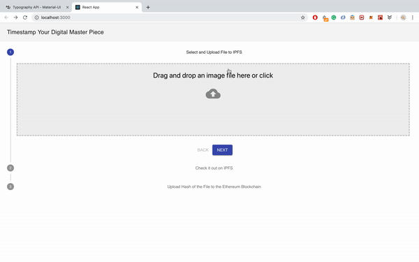

# timestamp-dapp

This decentralized app let's you upload a file to IPFS and afterwards store the unique hash of this file on the Ethereum Blockchain. 



##Installation
###IPFS must be installed and running
**IPFS** installation guide can be found [here](https://docs.ipfs.io/introduction/install/).

Run daemon with the following command:

```
ipfs daemon
```

###Truffe smart contract compilation and deployment
```
truffle develop
```
Then compile the contract

```
compile
```
and 

```
migrate
```
or if you have already migrated before

```
migrate --reset
```

